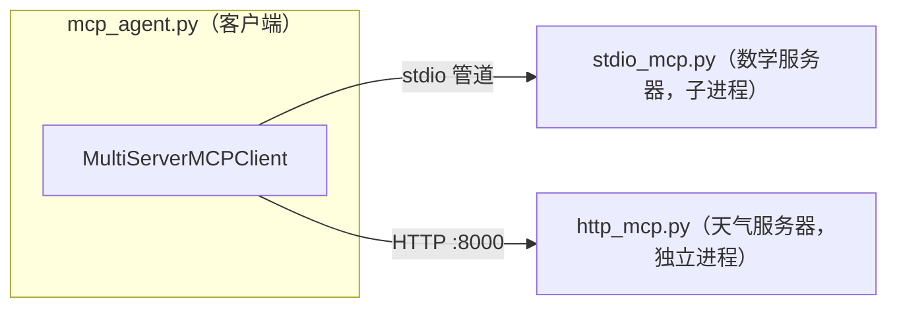

# MCP 的三种传输机制（Transport）

> 环境：`mcp 1.29.0` + `langchain-mcp-adapters 0.3.2` + `ai_agent` conda 环境
> 配套代码：`./stdio_mcp.py`（数学服务器）、`./http_mcp.py`（天气服务器）、`./mcp_agent.py`（客户端）
> 一句话：**三种方式里的服务器都是"独立项目"，区别只在"谁把它拉起来、它住哪儿"。**

---

## 📦 三种机制一览

| 传输 | 服务器怎么跑 | 客户端怎么连 | 特点 |
|---|---|---|---|
| **stdio** | 客户端把服务器当**子进程**拉起来 | 通过标准输入/输出（管道）通信 | 本地、一对一、最简单 |
| **Streamable HTTP** | 服务器是**独立运行**的服务 | 发 HTTP 请求 | 支持远程连接、多个客户端 |
| **SSE**（Server-Sent Events） | Streamable HTTP 的变体 | HTTP 请求 + 服务端单向流式推送 | 针对实时流式通信优化 |

---

## 🧓 老奶奶版比喻

1. **stdio —— 大厨在您家厨房**
   您请了个大厨上门，他就站在您自家灶台边。您把菜递给他（stdin），他把做好的菜端回您手边（stdout）。一伸手就够着，最快最省事，但大厨只能服务您这一家，也出不了家门（只能本地的工具）。

2. **Streamable HTTP —— 打电话叫外卖**
   大厨在城那头开饭馆（独立服务器），您在一边打电话点菜（发 HTTP 请求）。好处：饭馆能同时接好多家客人（多客户端）、隔着千山万水也能点（远程）。坏处：来回是"问一句答一句"。

3. **SSE —— 饭馆给您桌上拉了条"直播线"**
   HTTP 的改良款，专门为了"看着它一样样出锅"。不是等全做好才送来，而是边做边往您桌上送，服务端**不停往外推**数据流。适合"一句话得蹦半天"的活，比如让模型一个字一个字往外蹦地回答。

---

## 🎯 最容易误解的一点：服务器到底是谁的？

**三种方式里，MCP 服务器永远是"别人家的独立项目"。** agent 应用（如 `mcp_agent.py`）只当**客户端**。真正的区别：

| | 服务器是谁的 | 谁把它拉起来 | agent 怎么说话 |
|---|---|---|---|
| **stdio** | 独立项目 | **agent 自己拉起来**（当场雇的临时工） | 家里递菜（管道） |
| **HTTP / SSE** | 独立项目 | **别人早就开好的**（外面常年开着的饭馆） | 打电话（走网络） |

- **stdio**：配置里写的是"启动命令"（`command` + `args`）。agent 一启动，亲手把服务器进程拉起来，用 stdin/stdout 两根管子通信。**它的生老病死都挂在 agent 身上** —— agent 关了它也收摊。所以看起来"像 agent 的一部分"，其实代码是独立项目。
- **HTTP / SSE**：配置里写的是"连接地址"（`url`）。服务器是别处**早已部署运行**的服务，agent 只是打电话过去。agent 挂了它照样开，还能同时服务多个客户端。

---

## 📂 对应到本目录的三个文件



| 传输 | 服务器文件 | agent 里对应配置 |
|---|---|---|
| stdio | `stdio_mcp.py` | `{"transport": "stdio", "command": ..., "args": [stdio_mcp.py]}` |
| streamable_http | `http_mcp.py` | `{"transport": "streamable_http", "url": "http://localhost:8000/mcp"}` |

**跑起来**（两个终端）：

```bash
conda activate ai_agent
python study/06-mcp/http_mcp.py     # 先把天气服务器拉起来（8000 端口）
python study/06-mcp/mcp_agent.py    # 再跑客户端，stdio 数学服务器由客户端自己拉起
```

---

## 🔍 技术细节

- **stdio**：`MultiServerMCPClient` 收到 `transport: "stdio"`，就 `subprocess` 拉起 `command`，把服务器进程的 stdin/stdout 当成 JSON-RPC 通道。因为 stdout 被占用，**服务器端 `print` 会污染通道** —— 你在终端看到的 `Processing request of type ListToolsRequest` 就是子进程日志直接怼到 stdout 的结果。
- **Streamable HTTP**：标准是 POST 请求走 JSON-RPC，服务器**用 SSE 把响应/事件流式推回**。`initialize` 先握手拿 `mcp-session-id`，之后的请求带这个会话 id。
- **SSE 在哪儿**：新规范（2025-06-18）里，"Streamable HTTP"内部就用 SSE 做服务器→客户端的流式通道；单独的历史遗留"SSE transport"（GET /sse + POST /messages）已基本退役。所以文档里说"SSE 是 Streamable HTTP 针对实时流式通信的变体"。

---

## ⚠️ 踩坑记录（本机实测）

1. **`langchain-mcp-adapters` 0.1.0+ 已移除 `async with` 用法**
   `MultiServerMCPClient` 不能当上下文管理器（`__aenter__` 直接 `NotImplementedError`）。正确姿势：直接 `client = MultiServerMCPClient({...})`，然后 `tools = await client.get_tools()`。每个工具调用会自己建会话。

2. **代理软件会劫持 localhost，让 SSE 挂死**
   本机装了 Hiddify 之类代理软件，它把 Windows 系统代理指到 `127.0.0.1:12334`。`httpx` 默认 `trust_env=True` 会走系统代理，把 localhost 请求也劫到代理里，而代理对 SSE 流式响应处理不好 → 连接一直挂住/`httpx.ReadError`。curl 不走系统代理所以没事。
   - 治本：关掉代理的系统代理，或把 localhost 加进代理白名单。
   - 应急：运行前 `NO_PROXY=localhost python mcp_agent.py`。
   - 代码里硬绕（已从示例移除，仅记录）：给天气配置传 `httpx_client_factory`，工厂里 `httpx.AsyncClient(trust_env=False)`。

3. **`mcp` 包安装损坏会连锁炸**
   曾出现 `mcp/types.py` 和一个残留的 `mcp/types/` 目录并存，目录把模块遮蔽导致 `import mcp` 都失败（`cannot import name 'TASK_STATUS_COMPLETED'`）。这是升级残留，删掉残留目录即可（本机已改名 `types.bak` 处理）。

---

## 相关文件

- `./stdio_mcp.py` — 数学服务器（stdio 传输），`add` / `multiply`
- `./http_mcp.py` — 天气服务器（streamable HTTP 传输），`get_weather`
- `./mcp_agent.py` — 同时连两个服务器的客户端（用 `MultiServerMCPClient`）
