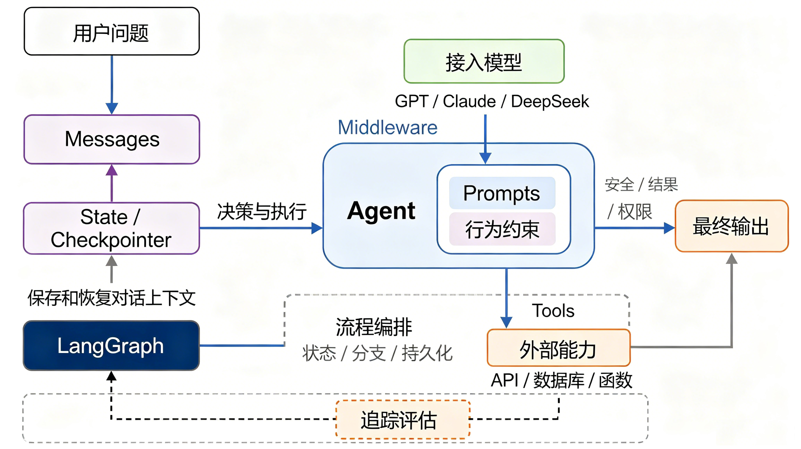

# AI Agent 架构详解

> 结合架构图，逐步拆解 LangChain / LangGraph 智能体的核心组件，并映射到
> [`study/simple_agent.py`](./simple_agent.py) 中的实际代码。



## 一、图的整体判断

这是一张 **AI Agent（智能体）架构图**，展示的是一个典型的 **Agent 循环（agent loop）**：

> 用户提问 → 问题进入对话消息列表 → 模型基于系统提示做出决策 → 若决定调用工具则执行 → 工具结果写回对话 → 模型再次决策……直到模型不再调用工具，输出最终结果。

这正是 `create_agent` 在幕后用 LangGraph 构建的循环结构。

## 二、组件逐块拆解

| 图中组件 | 含义 | 对应 simple_agent.py 代码 |
|---------|------|--------------------------|
| **用户问题 → Messages** | 用户输入进入对话消息列表，构成模型可读的上下文 | `agent.invoke({"messages": [{"role": "user", "content": "外面的天气怎么样？"}]})` |
| **State / Checkpointer** | 对话状态的保存与恢复机制。**State** = 整个对话状态（消息列表等）；**Checkpointer** = 每步执行后把状态落盘，`thread_id` 决定读写哪一段会话 | `checkpointer = InMemorySaver()` + `config = {"configurable": {"thread_id": "1"}}` |
| **LangGraph（流程编排 / 状态 / 分支 / 持久化）** | 图框架，负责节点编排（agent、tools）、条件分支（有无 tool_calls）、状态管理和记忆 | `agent = create_agent(...)` —— 内部构建并编译一个 LangGraph 状态图，返回值类型为 `CompiledStateGraph` |
| **决策与执行** | agent 节点判断"要不要调工具、调哪个、参数是什么" | 模型返回含 `tool_calls` 的 AIMessage，图收到后触发工具节点 |
| **接入模型（GPT / Claude / DeepSeek）** | 大模型本体，负责推理与决策 | `model = init_chat_model("deepseek:deepseek-chat", temperature=0)` |
| **Prompts + 行为约束** | 系统提示词、角色设定、可用工具说明，约束模型行为 | `SYSTEM_PROMPT`："你是一位擅长用双关语表达的专家天气预报员，可使用两个工具…" |
| **Tools** | 暴露给模型可调用的工具清单（函数 → `BaseTool`） | `tools=[get_user_location, get_weather_for_location]`（由 `@tool` 包装） |
| **外部能力（API / 数据库 / 函数）** | 工具真正执行的外部世界交互 | 函数体：`return f"{city}总是阴雨连绵！"` |
| **最终输出** | 按结构化 schema 返回的结果 | `response['structured_response']`，符合 `ResponseFormat` 数据类 |
| **追踪评估** | 可观测性：记录每次模型调用、工具调用、耗时、Token，用于调试与评测 | 对应 **LangSmith**（设置 `LANGSMITH_TRACING` 后自动开启 trace） |

## 三、数据流与关键箭头

1. **用户问题 → Messages → State**
   用户输入不是一次性"丢"给模型，而是追加进消息列表成为 State 的一部分。

2. **Messages ↔ Checkpointer（双向）**
   对话每轮执行后都会被持久化。同一 `thread_id` 下，下一轮 `invoke` 会读回历史——这就是第二次说"谢谢！"时模型仍记得天气话题的原因。**记忆 = State + Checkpointer**。

3. **State / Checkpointer → Agent（决策与执行）**
   模型从 State 中读取完整消息上下文，决定下一步动作。

4. **模型 → Agent 内部（Prompts + 行为约束）**
   模型只是"大脑"，其行为被系统提示词约束；它看不到也碰不到外部系统，所有对外操作都必须经过 Tools 这扇"门"。

5. **Agent → Tools → 外部能力**
   模型输出 `tool_calls` → 图执行对应工具 → 工具操作真实 API / 数据库 / 函数 → 结果作为 `ToolMessage` 写回消息列表。

6. **Agent / 外部能力 → 最终输出**
   循环结束（模型不再调用工具）后，Agent 按 `response_format` 将回答解析成结构化对象返回。

7. **追踪评估（虚线连接）**
   LangGraph 每次状态变更都产生事件流，LangSmith 订阅这些事件做 trace / 评测 / 调试，属于 Agent 工程里"可观测性"一环。

## 四、Agent 循环的完整运行序列

以 `simple_agent.py` 第一次调用为例：

```
1. invoke 传入 {"messages": [{user: "外面的天气怎么样？"}]}
2. LangGraph 从 Checkpointer 加载 thread_id="1" 的历史（空）
3. agent 节点：组装 system_prompt + 用户消息 + 工具 schema → 发给 deepseek
4. 模型决策：需要知道用户位置 → 返回 tool_call: get_user_location()
5. 图执行工具：注入 ToolRuntime，从 context.user_id="1" 查出位置 → "Florida"
6. ToolMessage 写回消息列表
7. agent 节点再次调用模型（现在上下文含位置信息）
8. 模型决策：查询天气 → tool_call: get_weather_for_location(city="Florida")
9. 图执行工具 → "佛罗里达总是阴雨连绵！"
10. 再次调用模型 → 模型组装双关语回答，不再调用工具
11. 按 ResponseFormat 解析 → structured_response
12. 状态写回 Checkpointer，本轮结束
```

## 五、架构要点小结

- **Agent = 模型 + 工具 + 编排 + 记忆 + 可观测性**，缺一不可。
- **工具是能力的边界**：模型只管"决定做什么"，"怎么做"交给工具。
- **记忆分两层**：`context`（每次运行临时数据，如 `user_id`）与 `thread_id` 对应的持久化对话状态，二者不要混淆。
- **结构化输出**（`response_format`）让 Agent 的结果可被程序直接消费，而非自由文本。

---

*图片来源：原图为概念架构图，本文档与 [`simple_agent.py`](./simple_agent.py) 的对照分析基于 LangChain / LangGraph 当前 API。*
